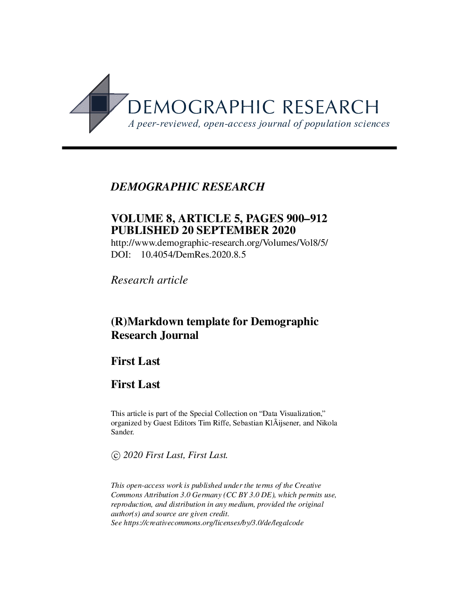

# Demographic Research Pandoc/Rmarkdown LaTeX template

Jonas Schöley

- `drtemplate.tex`: The Demographic Research LaTeX template to be called by [pandoc](https://pandoc.org/).
  - `drtitling.sty`: Defines the style for the title command. Place into same folder as `drtemplate.tex`.
  - `drbibstyle.bst`: The specification for the bibliography format. Place into same folder as `drtemplate.tex`.
  - `drlogo.pdf`: Provides a logo for the cover. Place into same folder as `drtemplate.tex`.
- `example.Rmd`: Example [rmarkdown](https://rmarkdown.rstudio.com/) file demonstrating the usage of `drtemplate.tex`.
- `references.bib`: Bibtex bibliography file.
