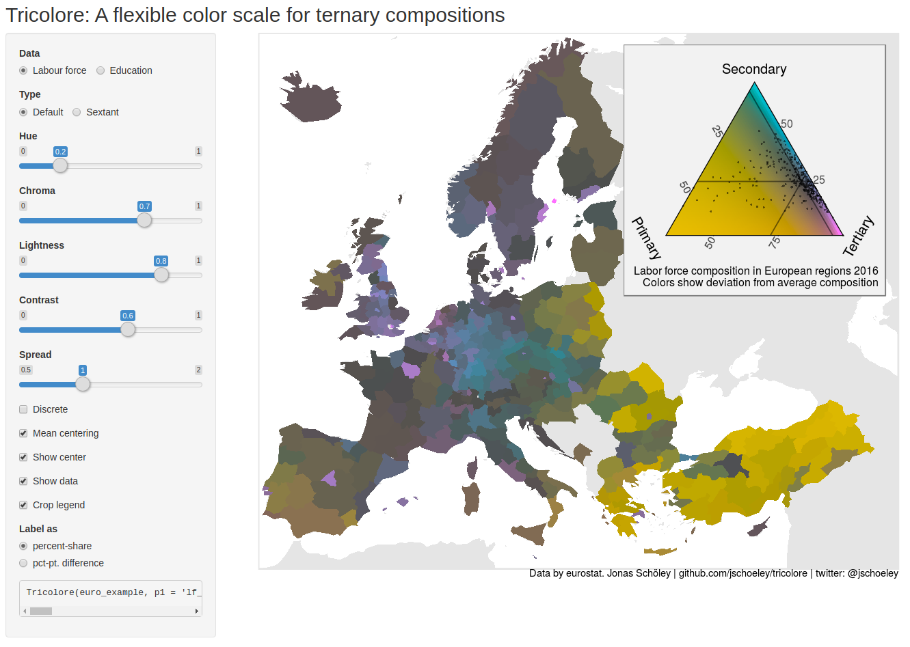

```{r setup, include=FALSE}
knitr::opts_chunk$set(
  echo = FALSE,
  message = FALSE,
  warning = FALSE,
  cache = FALSE,
  fig.env='figure'
)
```

# Introduction

Lorem ipsum dolor sit amet, id mel oratio lucilius eloquentiam, nam cu mazim erant aliquip. Nam et minim abhorreant, ferri minimum facilisis ad sit. In cum summo civibus appareat. Mei cu legimus accusata dissentiet. Qui illud gloriatur te. Probatus accommodare ut est, sed et atqui equidem dignissim.

Soluta legimus qui id, nam semper malorum ut. Est magna clita civibus id. Pro ne summo animal. Ne mucius partiendo sit, ne eos natum quodsi periculis.

Te usu movet nominavi, eu eum quod consul. Justo eligendi concludaturque no eam, aliquam fuisset convenire vis ne, purto vide instructior ex duo. An solet appetere sit, ea vis dolore aliquid scaevola, has omnes dolores eu. Eu per enim dolor civibus, no usu consul propriae. Vix id sale civibus definitiones, quis soluta an eum.

# Figures and Tables

Variably referred to as de Finetti-, simplex-, or triangle plot, the ternary diagram is based upon a coordinate system that maps each point within an equilateral triangle to a unique three-part composition and as such has found use wherever the problem domain spans three parts of a whole. The diagram emerged during the 18th century as a means of illustrating relative mixtures of primary colors [@Howarth1996]. It was subsequently adopted as the standard method to depict phase transitions in three-component alloys [@Bancroft1897], the genotype composition of a population [@DeFinetti1926], soil composition [@Davis1927], or the potential for flammability given different mixtures of three gases [@Zabetakis1965]. In the social sciences, ternary diagrams depict population compositions along demographic characteristics, with an early example appearing in the USSR's first census report showing the distribution of workers across labor market segments in various regions [@Kvitkin1932].^[A footnote [@Ware2013; @Denil2015]. Soluta legimus qui id, nam semper malorum ut. Est magna clita civibus id. Pro ne summo animal. Ne mucius partiendo sit, ne eos natum quodsi periculis.]

```{r fig.cap='Demonstration of the ternary balance scheme showing the composition of educational attainment by region in Europe 2016. Data by Eurostat.'}
knitr::include_graphics('figure1.pdf')
```



```{r}
knitr::kable(head(iris), caption = 'A table with a caption that stretches across two lines. Nearly there... Done. Does it align nicely?', booktabs = TRUE)
```


# Equations

Given the observed death counts $D_{jk}$ in age group $j$ and stratum $k$ and associated person-days of exposure to risk $O_{jk}$ I fit the model

\begin{equation}
  \begin{aligned}
    D_{jk} &\sim \text{Pois}\left(\lambda_{jk}O_{jk}\right) \\
    \lambda_{jk} &= e^{\beta_{0k} +
    \beta_{1k}\log(x_{jk}+1) +
    \beta_{2k}\log^2(x_{jk}+1)},
  \end{aligned}
(\#eq:themodel)
\end{equation}

where $\lambda_{jk}$ are mortality rates by age group and stratum. For each stratum, a smooth hazard is recovered by evaluating $\lambda_{jk}$ over a continuous range of ages $x$.

The stratum specific coefficients $\beta_{0k}$, $\beta_{1k}$, $\beta_{2k}$ are sums of baseline coefficients $\beta$, prematurity effects $\beta^\text{Pm}$, prematurity-birth weight interactions $\beta^{\text{Pm}\times\text{Bw}}$, and prematurity-birth weight-Apgar interactions $\beta^{\text{Pm}\times\text{Bw}\times\text{Ap}}$ resulting in the multilevel structure

$$
\left(\begin{aligned}
\beta_{0k} \\
\beta_{1k} \\
\beta_{2k}
\end{aligned}\right) =
\underbrace{\left(\begin{aligned}
\beta_0 \\
\beta_1 \\
\beta_2
\end{aligned}\right)}_{\substack{\text{lvl 0} \\ \text{ baseline coef.}}} +
\underbrace{\left(\begin{aligned}
\beta_{0,p[k]}^\text{Pm} \\
\beta_{1,p[k]}^\text{Pm} \\
\beta_{2,p[k]}^\text{Pm}
\end{aligned}\right)}_{\substack{\text{lvl 1} \\ \text{ deviations by} \\ \text{prematurity}}} +
\underbrace{\left(\begin{aligned}
\beta_{0,p[k],b[k]}^{\text{Pm}\times\text{Bw}} \\
\beta_{1,p[k],b[k]}^{\text{Pm}\times\text{Bw}} \\
\beta_{2,p[k],b[k]}^{\text{Pm}\times\text{Bw}}
\end{aligned}\right)}_{\substack{\text{lvl 2} \\ \text{ deviations by} \\ \text{birth weight given} \\ \text{prematurity}}} +
\underbrace{\left(\begin{aligned}
\beta_{0,p[k],b[k],a[k]}^{\text{Pm}\times\text{Bw}\times\text{Ap}} \\
\beta_{1,p[k],b[k],a[k]}^{\text{Pm}\times\text{Bw}\times\text{Ap}} \\
\beta_{2,p[k],b[k],a[k]}^{\text{Pm}\times\text{Bw}\times\text{Ap}}
\end{aligned}\right)}_{\substack{\text{lvl 3} \\ \text{ deviations by} \\ \text{Apgar given} \\ \text{prematurity and} \\ \text{birth weight}}},
$$

where $p[k], b[k]$ and $a[k]$ denote the prematurity, birth weight and Apgar level associated with stratum $k$. Except for the baseline $\beta$'s each set of coefficients is assumed to be drawn from a multivariate-Normal distribution with zero mean and covariance matrix

$$
\Sigma = \begin{pmatrix}
    \sigma^2_{\beta_0} & \sigma_{\beta_0\beta_1} & \sigma_{\beta_0\beta_2} \\
    \sigma_{\beta_0\beta_1} & \sigma^2_{\beta_1} & \sigma_{\beta_1\beta_2} \\
    \sigma_{\beta_0\beta_2} & \sigma_{\beta_1\beta_2} & \sigma^2_{\beta_2}
    \end{pmatrix},
$$

with separate estimates for levels one to three.

# Lists

- Ringo
  - Drums
- George
  - Guitar
- Paul
  - Bass
  - Piano
- John
  - Guitar
  - Piano
  
# Section

## Subsection

### Subsubsection

# Acknowledgments

I'd like to thank my husband whose caring love allowed me to fully concentrate on my work.